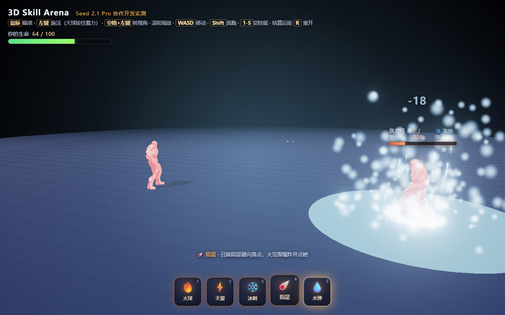

# Seed 2.1 Pro 3D Skill Arena

一个使用 Three.js、three.quarks 和官方 Soldier.glb 做出的浏览器 3D 技能对战 Demo。项目包含五种差异化技能、敌方弓手 AI、骨骼动画、生命值、胜负结算、重新开始和自动化行为验收。

[在线试玩](https://studiousxiaoyu.github.io/seed-2.1-pro-3d-skill-arena/)



## 功能

- 火球：按住左键蓄力，松开发射。
- 天雷：落点预警与连锁雷击。
- 冰刺：范围伤害并冻结敌人。
- 陨星：高空坠落、爆炸与焦痕。
- 水弹：抛物线飞行与落点水花。
- 敌人 AI：游走、转向、拉弓、放箭和受击死亡。
- 完整闭环：玩家/敌人生命值、胜利、失败、按钮或 `R` 键重开。

## 操作

| 操作 | 按键 |
| --- | --- |
| 移动 | `W A S D` |
| 奔跑 | `Shift` |
| 瞄准 | 鼠标移动 |
| 施法 | 鼠标左键；火球需要按住蓄力 |
| 切换技能 | 数字键 `1`—`5` 或点击技能图标 |
| 旋转视角 | `空格 + 鼠标左键拖动` |
| 缩放 | 鼠标滚轮 |
| 重新开始 | 结算界面按钮或 `R` |

## 本地运行

需要 Node.js 20 或更高版本。

```bash
npm install
npm start
```

打开 `http://127.0.0.1:8123`。

## 自动验收

```bash
npm test
```

测试会执行语法检查并通过 Playwright 驱动浏览器，覆盖五种技能伤害、冻结、敌箭命中、胜负状态、重开复位、对象回收、窗口缩放和控制台异常。当前基线为 `37 passed, 0 failed`。

Windows 默认使用系统 Edge；其他环境可先安装 Playwright Chromium，再运行：

```bash
npx playwright install chromium
BROWSER_CHANNEL=chromium npm test
```

## GitHub Pages

推送到 `main` 后，`.github/workflows/pages.yml` 会安装依赖、运行浏览器测试、生成纯静态产物并部署到 GitHub Pages。仓库不提交 `node_modules`。

## 项目结构

```text
css/                     HUD 与结算界面样式
js/                      场景、技能、角色与敌人逻辑
models/Soldier.glb       Three.js 官方示例角色
textures/                粒子纹理
scripts/                 本地服务器、语法检查与 Pages 构建
test/run-checks.mjs      端到端行为验收
evidence/final-polish/   最终验收截图
```

## 已知边界

- 首次打开需要加载约 2 MB 的 GLB 角色文件。
- 自动测试在无头环境使用软件渲染，速度会慢于桌面浏览器。
- 这是技能沙盒 Demo，不含关卡、联网、存档和移动端触控适配。

## 许可与致谢

项目代码使用 [MIT License](LICENSE)。Three.js、three.quarks、Soldier.glb 与粒子资源的来源和许可见 [THIRD_PARTY_NOTICES.md](THIRD_PARTY_NOTICES.md)。
